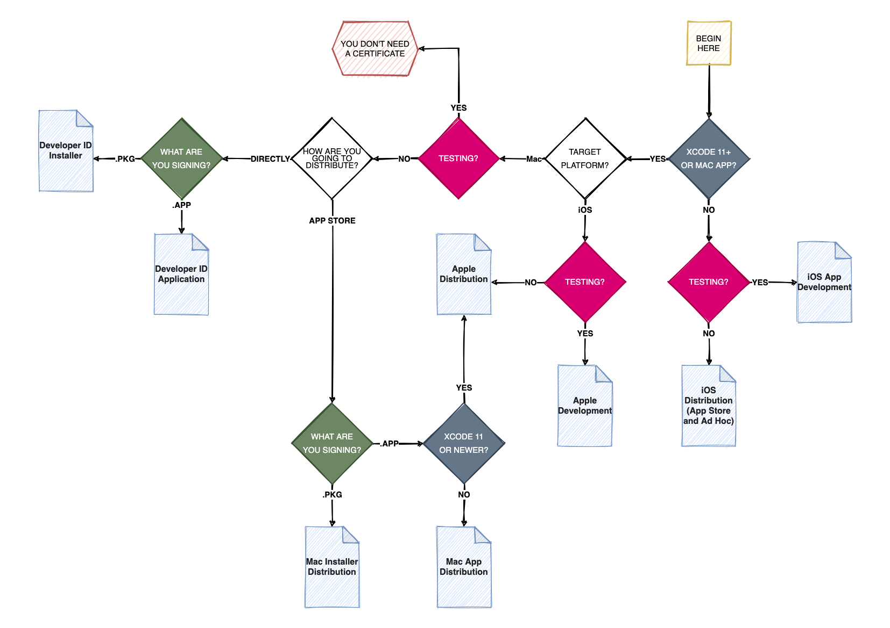
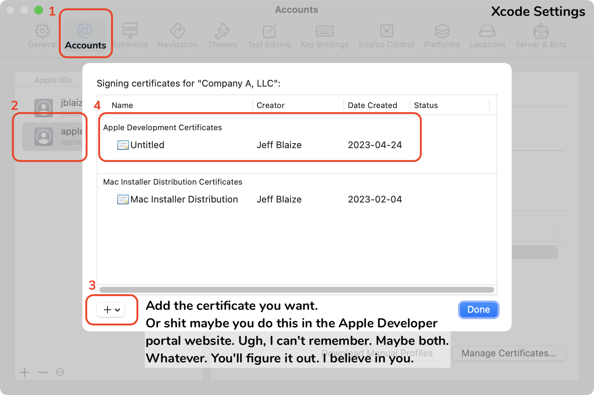
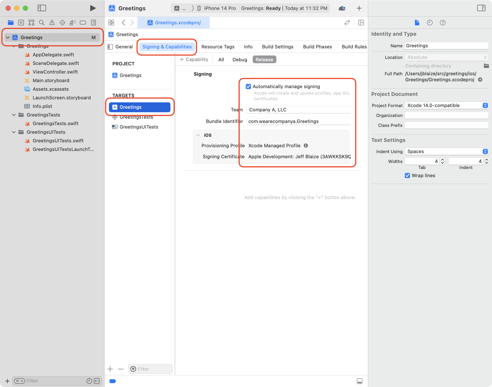

## Build & Deploy on iOS using Rust Libraries
###### notes from 2023-04-24


_This is a seemingly decent_ ["Hello World!"](https://mozilla.github.io/firefox-browser-architecture/experiments/2017-09-06-rust-on-ios.html) _I found at_ https://mozilla.github.io/firefox-browser-architecture/experiments/2017-09-06-rust-on-ios.html _on the Interwebs. Commentary, issues, bugs noted below..._

I just realized I made this repo **public** on accident, and although I'm sure it's super easy to switch it to private, I figured what the hell... Maybe someone out there can learn from what I find by following along. You see, I'm completely new to Rust, so every moment with it is a new one for me right now. Regardless, unlike the author of the above web page, I'm not trying to reach a larger audience, so if my shorthand notes suck, you should prob refer back to the original text or just buzz off. ☮

Let's do this...

**Ok, I'll throw you one bone.** You're gonna need Xcode commandline shit installed `(xcode-select --install)`, but just install the entire Xcode.app from the store b/c you'll need all of it. And you'll need [Homebrew](https://brew.sh/) installed. If you don't know what that is, honestly don't bother with this right now. Go get some sun and ride a bike or talk face-to-face with a beautiful woman somewere and pretend you never heard these terms. Seriously, go. Be free. Bye. You're welcome.

Anyway, you obviously need git and/or the Github cmdline tools, and Rust. I've found the best way to install Rust via `brew` is by installing `rustup-init` (and running that) instead of installing `rust`. I think that's what I did... Hrm, either that or I ran the installer by hand. Who cares. _Oh shit, I'm doing it again: writing for an audience. I don't have time for that, I'll never get thru this that way, so that stops now..._ 🖕

```
$ mkdir greetings; cd greetings/
$ cargo install cargo-lipo  # THE cross-compiler secret sauce that supposedly makes iOS a worthwhile destination.
$ rustup target add aarch64-apple-ios armv7-apple-ios armv7s-apple-ios x86_64-apple-ios i386-apple-ios
```
Oops. The 32-bit support for the crossed out packages above are no longer valid: `armv7-apple-ios` and `armv7s-apple-ios`. Oh and `i386-apple-ios`. Just 3 of the 5 listed. (I'm not getting a warm and fuzzy about this working at his point.) Anyway, retry that last line:

```
$ rustup target add aarch64-apple-ios x86_64-apple-ios  # iss cool. don't worry.
$ cargo new cargo  # to initialize the rust project
```
This last line creates a dir `cargo/` and fills it with:
1. a `Cargo.lock` file _(similar to package-lock? -Ed.)_
1. a `Cargo.toml` file _(maybe like package.json? -Ed.)_
1. `src/` and `target/` dirs inside `cargo/`, prob for what they sound like they're for.
1. a badly needed `.gitignore` and other git shit (+10 points for rhyming)
```
$ mkdir ios
```

Note: next we're editing the `src/lib.rs` file in the doc, except it's actually called `main.rs`. That seems like a potential problem. _**Note from me in the future: It is. Rename it to_ `main.rs` _now._

(See the comments in the `lib.rs` file.) Then from the `cargo` directory, we build this mfer:

```
$ pwd
$ cargo lipo --release
```

In Xcode 14.3, making a new project, it's just iOS -> App (not Single View Application). It's probably best if you get your Apple Developer cert setup again. In Xcode -> Settings -> Accounts -> `<your Apple Developer ID>` -> `<select Team>`. From there, create the right type of cert. I couldn't remember which type of cert to choose, but I found this somewhat handy diagram (even though the logic in it is not exactly solid if you think too hard on it). Apologies to whoever made this; I'd give you credit, but I don't remember where I found it..



You'll need that cert made in Apple Developer Portal (https://developer.apple.com/) then head to Certificates -> (+) symbol next to Certificates to make a new one -> Select the matrix item under Software, name your app and create the cert, download it, install into **Keychain Access.app** in macOS. Then make sure it's set in your project in Xcode in your project name under TARGETS -> Signing & Capabilities tab.



And here's what the Xcode project console looks like for signing:



One other note from the webpage we're following: if you're on an M1/M2 (Apple Silicon chip) Mac, you need to hard-set under the **Build Settings** tab (when you have your Greetings project under TARGETS selected) -> Architectures section -> Excluded Architectures and set this to `arm64`. It's a bug in the way this puzzle fits together, and this is the only workaround, which is stupid because it has to build arm64 to get on the iPhone anyway. Not my problem, don't care, whatever, go Apple.

Also, when it asks you to add Frameworks, I had to add them by hand twice each time before they would show up. (This is Xcode 14.3)
Finally when the instructions tell you to add the header file `Greetings-Bridging-Header.h` it tells you to just add it to the project file which defaults to the first `Greetings/` directory. The file needs to be in the subdirectory of that with the same name. So the file should live here, relative to the `greetings/` folder that houses both sides of this project:

```
ios/Greetings/Greetings-Bridging-Header.h            # *WRONG*
ios/Greetings/Greetings/Greetings-Bridging-Header.h  # Correct.
```
And here's where it all falls apart.
I've only finished the first part of the final instructions, adding the final `RustGreetings.swift` file and code, but **not** the `ViewController.swift` or `viewDidLoad` parts because I couldn't find them, and I ran it...

AND IT WORKED. Somehow. But how?? Where was the "world!" part? Where did it live? I found that when I created the project in the first part, I set it up with the wrong parameters for the Swift code. I had:

- Interface: **SwiftUI** (it should've been **Storyboard**)
- Language: **Swift** (this was correct)

Apparently these two files I need to modify only exist in Storyboard. So I had to start it all over. Now that I'm doing it all over again "correctly" it seems, using Storyboard, adding to the right places, now nothing works. Well fuck.

Update: I symlinked the `greetings.h` file from `Greetings/` to `Greetings/Greetings/` so that it's loading properly within that directory, but something else is awry...


